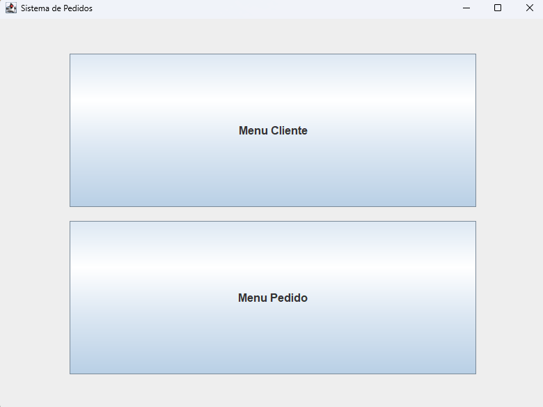
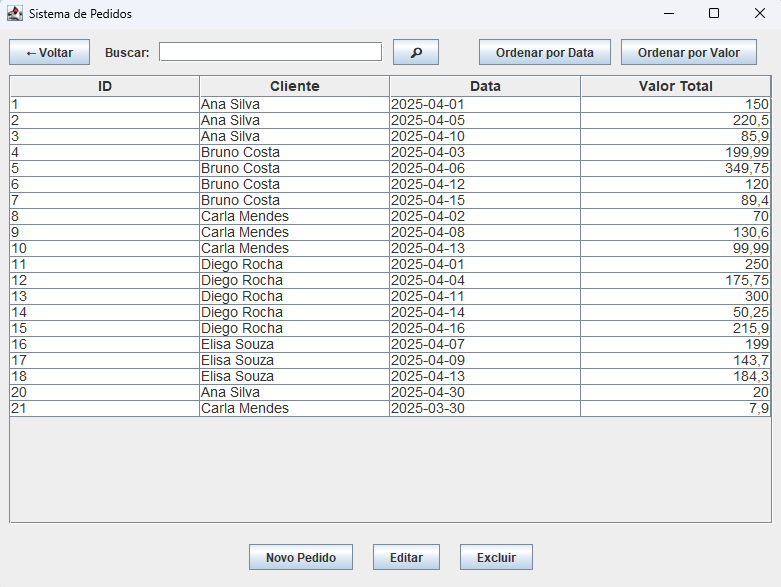

# Sistema de Gerenciamento de Pedidos

Este projeto é um sistema de gerenciamento de pedidos desenvolvido em Java, utilizando Spring Boot no backend, interface gráfica com Swing, e banco de dados MySQL.

## Pré-requisitos

- Java JDK 17 ou superior
- MySQL Server
- MySQL Workbench (opcional)
- Eclipse IDE com suporte a projetos Maven
- Git (opcional)

---

## 🚀 Como executar o projeto

### 1. Clone o repositório (opcional)

```bash
git clone https://github.com/seu-usuario/seu-repositorio.git
cd seu-repositorio
```

### 2. Crie o banco de dados

- Abra o **MySQL Workbench** ou outro cliente de SQL
- Execute o script abaixo para criar o banco e suas tabelas:

```sql
-- Arquivo: pedidos_script.sql
-- Execute este script no MySQL Workbench
```

> ⚠️ Certifique-se de anotar o nome do banco, usuário e senha, pois serão usados no `application.properties`.

---

### 3. Importe o projeto no Eclipse

1. Abra o Eclipse
2. Vá em `File` > `Import` > `Maven` > `Existing Maven Projects`
3. Selecione o diretório do projeto
4. Aguarde a indexação e o carregamento das dependências

---

### 4. Configure o `application.properties`

Abra o arquivo `src/main/resources/application.properties` e altere as informações conforme o seu ambiente:

```properties
spring.datasource.url=jdbc:mysql://localhost:3306/nomedobanco
spring.datasource.username=seu_usuario
spring.datasource.password=sua_senha
spring.jpa.hibernate.ddl-auto=update
spring.jpa.show-sql=true
spring.jpa.properties.hibernate.dialect=org.hibernate.dialect.MySQL8Dialect
```

---

### 5. Execute o sistema

- No Eclipse, localize a classe `PedidosApplication.java`
- Clique com o botão direito e selecione `Run As > Java Application`

Isso iniciará o Spring Boot e abrirá automaticamente a interface gráfica da aplicação.

---

## 🛠 Funcionalidades

- Cadastro, edição, exclusão e listagem de clientes e pedidos
- Busca textual
- Ordenação por data

---

## 📁 Estrutura do projeto

- `view/`: Telas da interface gráfica (Swing)
- `model/`: Entidades JPA
- `repository/`: Interfaces de acesso a dados
- `service/`: Lógica de negócios
- `util/`: Utilitários (como exportação CSV)

---

## 🧑‍💻 Contribuição

Contribuições são bem-vindas! Sinta-se livre para abrir uma *issue* ou enviar um *pull request* com melhorias ou correções.

---

## 🖼️ Capturas de Tela

### Tela Inicial


### Tela de Pedidos
